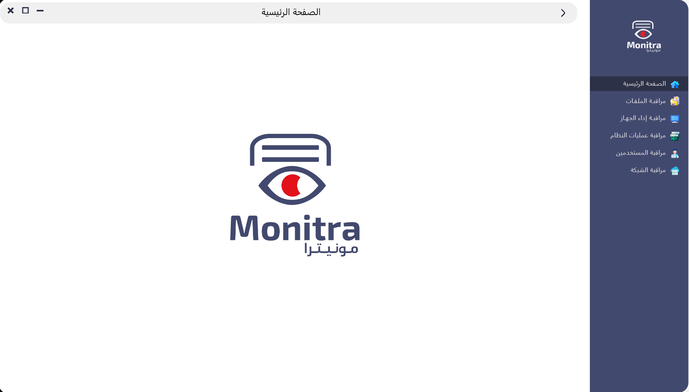
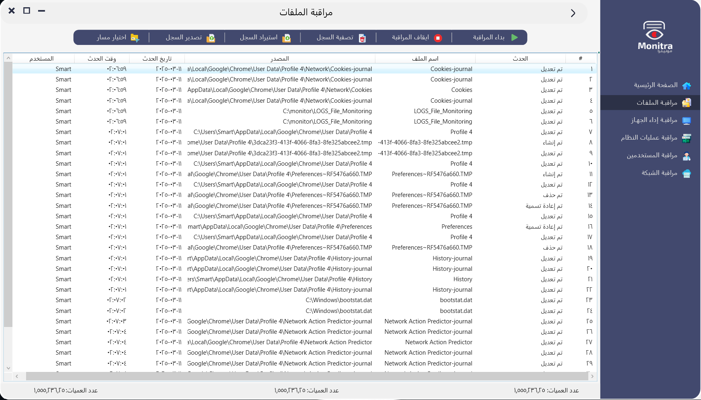
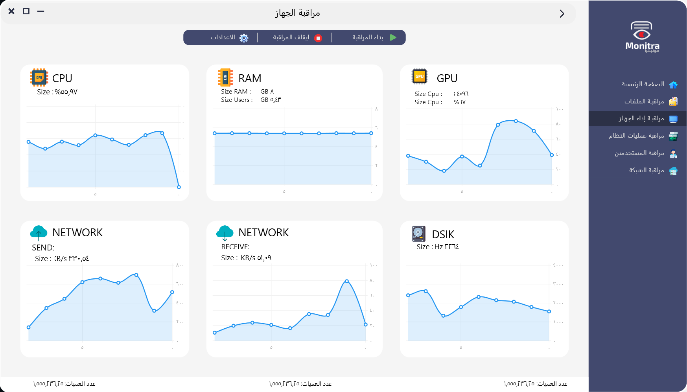
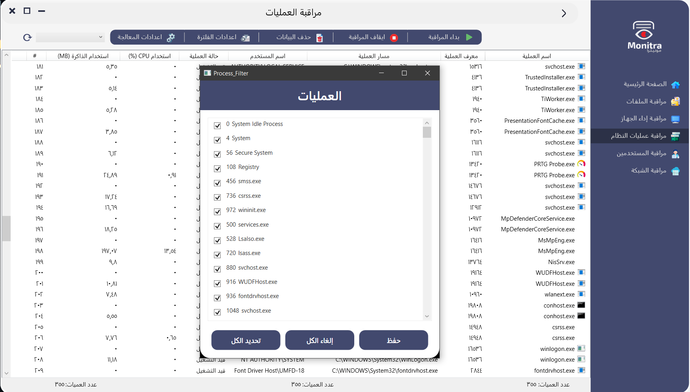
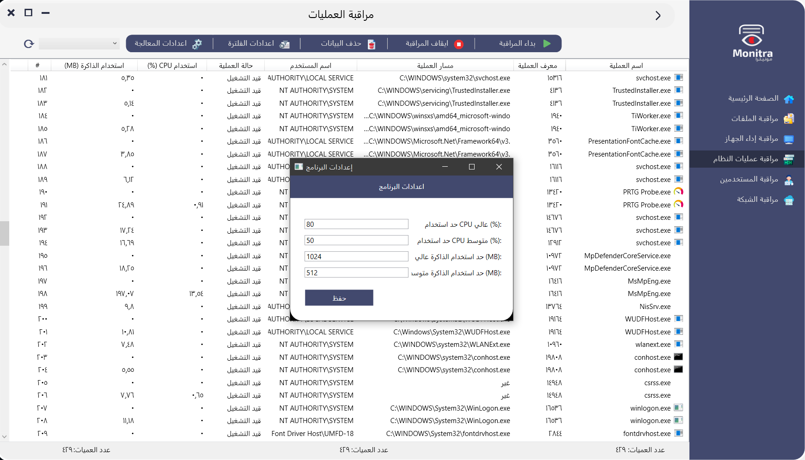
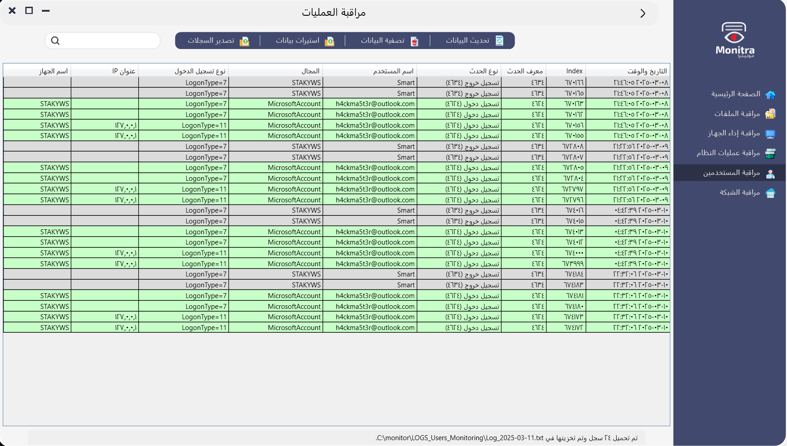
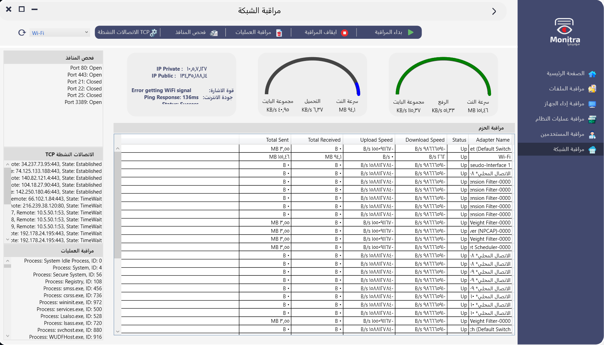

<h5>Design and development of a program to monitor system performance and operations to enhance security and track activities in a Windows environment.</h5>
 

<b>The program is designed using the XAML markup language and programmed using C#.</b>

<h3>This program contains several programming interfaces, and the main interfaces are five.</h3>
 

<b>Main interface</b>

  

<b>1- The first interface is the file monitoring interface, where file events are monitored and recorded on the program screen. File events, such as deleting, modifying, creating new files or folders, and renaming files, are recorded and stored in text files with the time, date, name, username, and device type.</b>

  

<b>2- The second interface is the device performance monitoring interface, such as monitoring CPU, RAM, GPU, KD, Total Sent Data, Total Receive Data, DISK (Hertz), and generating reports saved in files for each day of monitoring.</b>

  

<b>3- The third interface is the system process monitoring interface, where in this interface all system processes and side programs are monitored by the user and by the system, where in this interface even hidden processes are displayed that do not appear to the user even in the task manager, where this interface must be used by a professional in cyber security and be familiar with all the processes related to the system and the processes related to the user in order to be able to discover any harmful processes or spyware and hacking viruses that are disrupting the system and remove them easily and permanently forever.</b>

  

 

  

<b>4- The fourth interface is the user monitoring interface, which tracks logins and logouts, as well as records of incorrect password entries while logging into the system.</b>

  

<b>The fifth interface is the interface for monitoring network performance and operations.</b>

  

<h5>Where the following are displayed and monitored:</h5>

<ul>
  <li>Upload and download speed.</li>
  <li>Maximum upload and download speed.</li>
  <li>Volume of data uploaded and downloaded.</li>
  <li>Network interfaces with data transfer and those without.</li>
  <li>Volume of data sent and received on each internet interface.</li>
  <li>Display of the user's active and private IP.</li>
  <li>Display of internet strength and quality.</li>
  <li>Scanning and displaying open and closed ports using the internet.</li>
  <li>Displaying active connections and some network data using the TCP protocol.</li>
  <li>Displaying system processes using the network.</li>
  <li>Recording these data events in log files.</li>
</ul>

<h5 align="center">Only the basic features of the program have been mentioned, and I am continuing to develop this program, designing and innovating graphical interfaces that are easier and less complex than the current graphical interfaces in the program. 
  
Also developing software and performance and adding many features to it.

</h5>

<h4>Technologies Used:</h4>
<ul>
  <li>.NET Framework / .NET Core</li>
  <li>Windows Presentation Foundation (WPF)</li>
  <li>System.IO</li>
  <li>PerformanceCounter</li>
  <li>TCP/IP Sockets</li>
  <li>Windows Management Instrumentation (WMI)</li>
  <li>NetworkInterface</li>
  <li>EventLog</li>
  <li>Task Scheduler</li>
  <li>NLog</li>
</ul>
